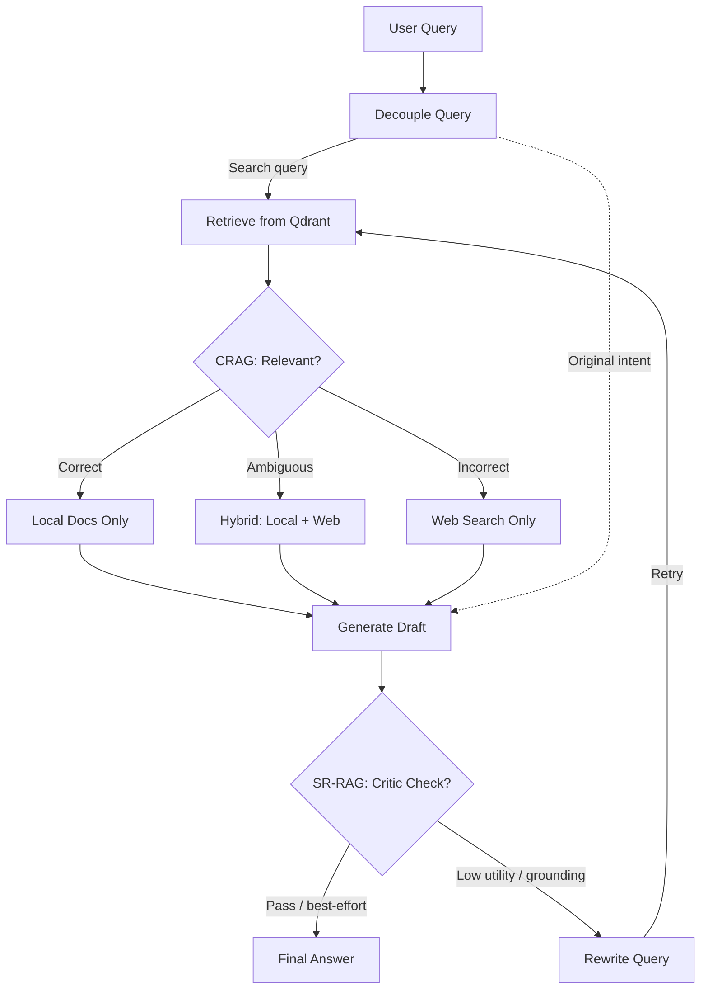
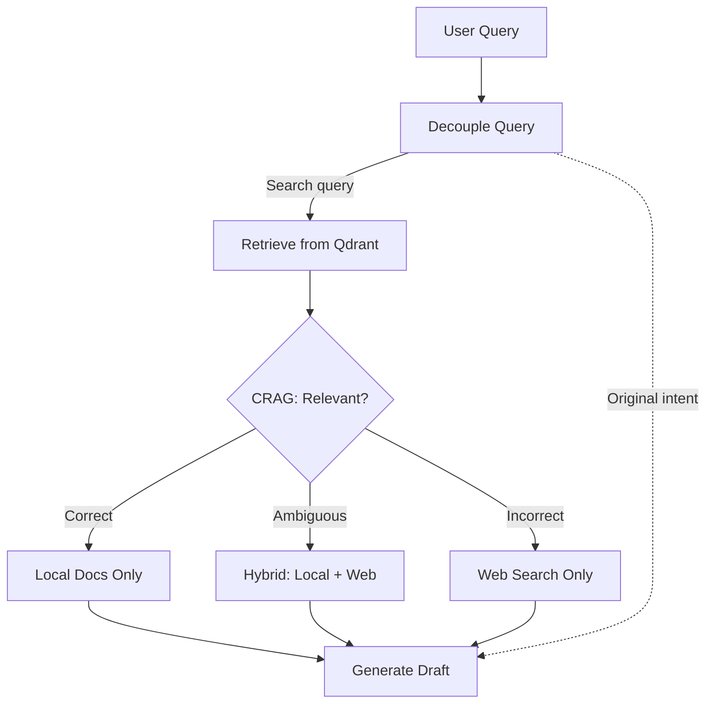

## Figure 5.1

```mermaid

flowchart TB
    UQ["User Query"] --> DQ["Decouple Query"]
    DQ -->|"Search query"| RET["Retrieve from Qdrant"]
    RET --> CRAG{"CRAG: Relevant?"}

    CRAG -->|"Correct"| LOCAL["Local Docs Only"]
    CRAG -->|"Ambiguous"| HYBRID["Hybrid: Local + Web"]
    CRAG -->|"Incorrect"| WEB["Web Search Only"]

    LOCAL --> GD["Generate Draft"]
    HYBRID --> GD
    WEB --> GD
    DQ -.->|"Original intent"| GD

    GD --> CRITIC{"SR-RAG: Critic Check?"}
    CRITIC -->|"Pass / best-effort"| FINAL["Final Answer"]
    CRITIC -->|"Low utility / grounding"| REWRITE["Rewrite Query"]
    REWRITE -->|"Retry"| RET
```

## Figure 5.4

```mermaid

flowchart TB
    UQ["User Query"] --> DQ["Decouple Query"]
    DQ -->|"Search query"| RET["Retrieve from Qdrant"]
    RET --> CRAG{"CRAG: Relevant?"}

    CRAG -->|"Correct"| LOCAL["Local Docs Only"]
    CRAG -->|"Ambiguous"| HYBRID["Hybrid: Local + Web"]
    CRAG -->|"Incorrect"| WEB["Web Search Only"]

    LOCAL --> GD["Generate Draft"]
    HYBRID --> GD
    WEB --> GD
    DQ -.->|"Original intent"| GD

```
